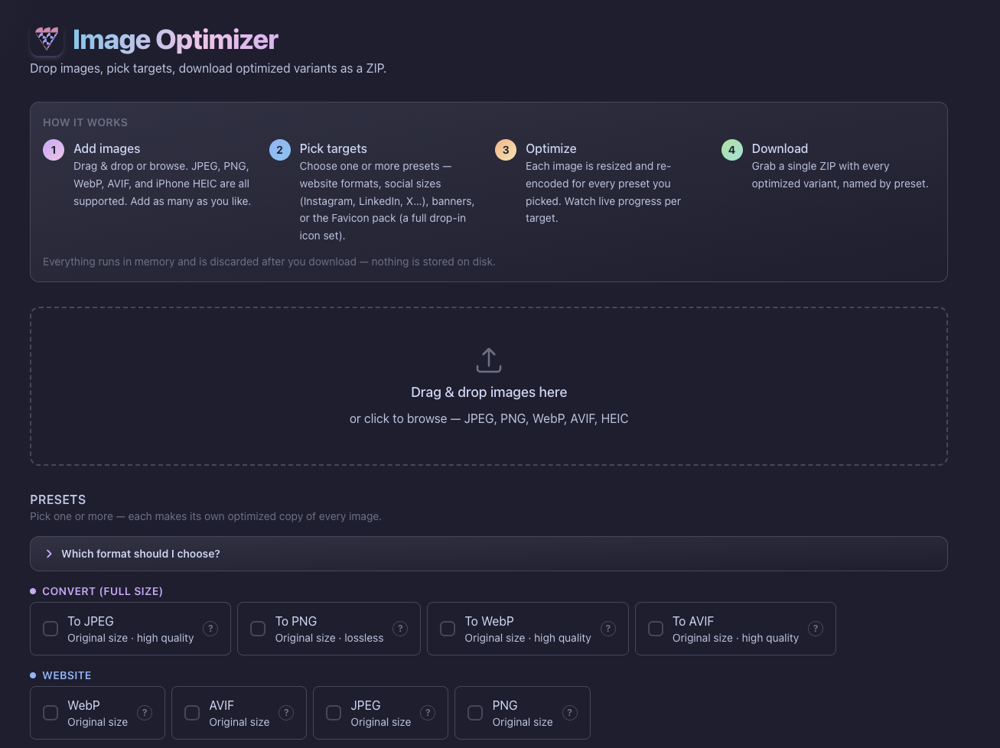

<h1 align="center">Image Optimizer</h1>

<p align="center">
  A fast, self-hostable web app that turns one image into every size and format
  you actually need — web formats, social media presets, and a complete favicon
  pack — and hands them back as a single ZIP.
</p>

<p align="center">
  <a href="https://img.hra42.com">
    
  </a>
</p>

<p align="center">
  <a href="https://img.hra42.com">
    
  </a>
</p>

Drop your images in the browser, tick the targets you want, and download the
optimized results. No accounts, no uploads kept on disk, no setup beyond running
one Docker container.

## Why

Preparing images for the web is repetitive: resize for Instagram, crop for an
Open Graph card, generate a dozen favicon files, re-encode to WebP/AVIF for
performance… usually across several tools. This does all of it in one drag-and-drop
step, runs entirely on your own server, and never writes your images to disk.

## Features

- **Many targets at once** — pick any combination of presets; each image is
  optimized for every selected target in parallel.
- **Modern + classic formats** — outputs WebP, AVIF, JPEG (progressive), and PNG.
- **Wide input support** — JPEG, PNG, WebP, AVIF, and iPhone **HEIC/HEIF**.
- **Drop-in favicon pack** — one click produces `favicon.ico`, all the PNG sizes,
  `apple-touch-icon`, `site.webmanifest`, and a ready-to-paste HTML snippet.
- **Social presets** — Instagram, LinkedIn, X, Facebook, Pinterest, Open Graph,
  plus email/web banners.
- **Live progress** — per-target progress streamed over Server-Sent Events.
- **Privacy by design** — images are processed in memory only and deleted right
  after download (or after a short timeout); nothing is stored.
- **Single container** — the Svelte UI is embedded into the Go binary, so the
  whole app is one small Docker image with no external services.

## How it works

1. **Add images** — drag & drop or browse (JPEG, PNG, WebP, AVIF, HEIC).
2. **Pick targets** — choose one or more presets.
3. **Optimize** — each image is resized/re-encoded for every target; watch live
   progress.
4. **Download** — get a single ZIP with every optimized variant, named by preset.

## Quick start

Run the prebuilt-style image locally (only Docker required):

```sh
docker build -t image-optimizer .
docker run -p 3000:3000 image-optimizer
```

Then open <http://localhost:3000> and start dropping images. See
[Production image](#production-image) for deployment details and
[Development](#development) for the hot-reload setup.

## Tech stack

- **Go + Fiber v3** — single compiled binary, low memory footprint
- **govips / libvips** — the image processing engine
- **Svelte + Vite** — zero-runtime SPA, embedded via `//go:embed`
- **Single Docker container** — Fiber serves both the API and the SPA

## Project layout

```
.
├── main.go            # Fiber app, config, graceful shutdown, embeds frontend/dist
├── config/            # env-var configuration (port, limits, workers, job TTL)
├── handlers/          # HTTP handlers: health, upload, progress (SSE), download
├── processor/         # govips pipeline, worker semaphore, presets
├── frontend/          # Svelte + Vite app; dist/ is the go:embed target
├── Dockerfile         # 3-stage build: Vite → Go (cgo+libvips) → debian-slim
└── docker-compose.yml # local dev with hot-reload
```

> **Note on `frontend/dist`:** a small stub `index.html` is committed so
> `go build` works locally without first running Vite. The Docker frontend
> stage overwrites it with the real Vite build.

## Supported formats & presets

**Input:** JPEG, PNG, WebP, AVIF, and HEIC/HEIF (iPhone photos). HEIC/HEIF are
decoded via libvips' `heifload` (libheif/libde265, bundled in the Docker images).

The **`convert_*` presets** are the "just turn this into a usable file" path:
faithful, high-quality format conversion at the original size (no crop). Handy for
turning an iPhone HEIC straight into JPEG/PNG/WebP/AVIF without any other tool.

**Output presets** (registry: `processor/preset.go`):

| Preset               | Format | Dimensions  | Notes                          |
| -------------------- | ------ | ----------- | ------------------------------ |
| `convert_jpeg`       | JPEG   | original    | quality 92, progressive — faithful conversion |
| `convert_png`        | PNG    | original    | compression 6 (lossless)       |
| `convert_webp`       | WebP   | original    | quality 90 — faithful conversion |
| `convert_avif`       | AVIF   | original    | quality 80, effort 4 — faithful conversion |
| `website_webp`       | WebP   | original    | quality 80 (web-optimized)     |
| `website_avif`       | AVIF   | original    | quality 60, effort 4 (web-optimized) |
| `jpeg_original`      | JPEG   | original    | quality 80, progressive        |
| `png_original`       | PNG    | original    | compression 6                  |
| `instagram_square`   | JPEG   | 1080×1080   | progressive                    |
| `instagram_portrait` | JPEG   | 1080×1350   | progressive                    |
| `instagram_story`    | JPEG   | 1080×1920   | progressive                    |
| `linkedin`           | JPEG   | 1200×627    | progressive                    |
| `twitter`            | JPEG   | 1200×675    | progressive                    |
| `facebook_post`      | JPEG   | 1200×630    | progressive                    |
| `pinterest_pin`      | JPEG   | 1000×1500   | progressive                    |
| `og_image`           | PNG    | 1200×630    | compression 6                  |
| `favicon`            | —      | —           | **favicon pack** (see below)   |
| `thumbnail`          | PNG    | 400×400     | compression 6                  |
| `remove_bg`          | PNG    | original    | **AI background removal** (see below) |
| `email_header`       | JPEG   | 600×200     | progressive                    |
| `web_banner`         | JPEG   | 1920×480    | progressive                    |

Fixed-size presets center-crop to the target dimensions; `*_original` presets
keep the source dimensions and just re-encode + strip metadata.

### Favicon pack

The `favicon` preset is a multi-file output: instead of one image it generates a
complete drop-in icon set, bundled under a `favicon/` folder in the ZIP:

- `favicon.ico` (multi-size 16/32/48, hand-built ICO container)
- `favicon-16x16.png`, `favicon-32x32.png`, `favicon-48x48.png`
- `apple-touch-icon.png` (180×180)
- `android-chrome-192x192.png`, `android-chrome-512x512.png`
- `site.webmanifest` and a `README.txt` with the exact `<head>` `<link>` snippet

The pack is generated from a center-cropped square master. The multi-file plumbing
lives in `Preset.Kind` / `Result.Files` (`processor/preset.go`,
`processor/favicon_vips.go`, `processor/ico.go`).

### Background removal

The `remove_bg` preset cuts out the foreground subject and outputs the image on a
transparent background as a PNG (at the original size). It runs **BiRefNet
(general lite)** — the SwinT-backbone variant of the 2024
[BiRefNet](https://github.com/ZhengPeng7/BiRefNet) dichotomous-segmentation model
(the current practical-on-CPU SOTA), shipped via
[rembg](https://github.com/danielgatis/rembg) — through ONNX Runtime, fully
self-hosted in-process: no Python, no network calls. The model (~224 MB) and the
onnxruntime shared library are vendored into the Docker image.

Notes:

- **Input must be JPEG or PNG.** This path decodes with Go's standard library
  (independent of libvips), which doesn't handle WebP/AVIF/HEIC — those inputs fail
  this one preset (others are unaffected).
- It is **CPU-heavy** — BiRefNet runs at 1024×1024 (vs the millisecond libvips
  presets), so expect a few seconds per image on CPU. Inference is serialized so a
  batch doesn't spike memory or thrash the worker pool. (If you need it faster and
  can accept lower edge quality, swap `ONNX_MODEL_PATH` to a lighter model such as
  `u2netp` / `isnet-general-use` — note each model has its own preprocessing, so a
  swap may need a code change.)
- The pipeline is gated behind the **`onnx` build tag** (alongside `vips`). A plain
  `go build` omits it, so local/stub builds report "background removal unavailable"
  for this preset — only the production Docker image can run it. The implementation
  lives in `processor/bg_onnx.go` (with the tag-free dispatch seam in
  `processor/bg.go`).

## Development

Hot-reload for both backend (Air) and frontend (Vite dev server):

```sh
docker compose up
```

- Backend: http://localhost:3000 (`/health` returns `{"status":"ok"}`)
- Frontend dev server: http://localhost:5173

## Production image

The single self-contained image (Vite build embedded into the Go binary):

```sh
docker build -t image-optimizer .
docker run -p 3000:3000 image-optimizer
curl http://localhost:3000/health   # -> 200 {"status":"ok"}
```

The final image contains only the Go binary plus the libvips runtime libs
(`libvips42`) on `debian:bookworm-slim`, and runs as a non-root user.

### Health check

The image ships a Docker `HEALTHCHECK` that probes `GET /health`. The binary
self-probes via its `-healthcheck` flag, so no `curl`/`wget` is needed in the
minimal runtime image:

```sh
docker run -d -p 3000:3000 image-optimizer
docker ps   # STATUS shows "healthy" once the start period elapses
```

### Graceful shutdown

On `SIGINT`/`SIGTERM` the server stops accepting new connections, drains
in-flight jobs (so their SSE clients receive a terminal event and the ZIP stays
briefly downloadable), tears down libvips, then exits. Each phase is bounded by a
30s timeout so shutdown never hangs.

### Job lifetime

Job state lives in memory only — there is no disk temp storage. A job is freed
when its ZIP is downloaded, or by a background reaper after `JOB_TTL_MINUTES`
(default 10), whichever comes first. This bounds memory for jobs that are never
downloaded.

## Environment variables

All configuration is via environment variables, read once at startup (the
resolved values are logged). Invalid or non-positive numeric values fall back to
the default rather than failing startup.

| Variable           | Default          | Description                                                        |
| ------------------ | ---------------- | ------------------------------------------------------------------ |
| `PORT`             | `3000`           | TCP port the HTTP server listens on.                               |
| `MAX_FILE_SIZE_MB` | `50`             | Per-file upload cap. Larger files are rejected with `400`.         |
| `WORKER_COUNT`     | number of CPUs   | Max concurrent libvips pipelines (the real concurrency limit).     |
| `JOB_TTL_MINUTES`  | `10`             | How long a job's in-memory state is retained before the reaper frees it. |
| `ONNX_MODEL_PATH`  | `/usr/local/share/onnx/birefnet-general-lite.onnx` | Path to the BiRefNet (general lite) model for the `remove_bg` preset (`onnx` builds only). |
| `ONNXRUNTIME_LIB_PATH` | `/usr/local/lib/libonnxruntime.so.1.26.0` | Path to the onnxruntime shared library, loaded at runtime (`onnx` builds only). Must match the onnxruntime version the binding tracks. |

The whole-request multipart body limit is derived from `MAX_FILE_SIZE_MB` plus
headroom for multiple files and multipart boundaries. The two `ONNX_*` variables
are only consulted by `onnx`-tagged builds (the production Docker image); a plain
local build ignores them.

## Requirements

- Go 1.26+ · Node 22+ · Docker
- libvips ≥ 8.14 (provided inside the Docker images; install locally only if
  building the Go binary outside Docker)

## License

Released into the public domain under [The Unlicense](LICENSE) — do whatever you
want with it.
